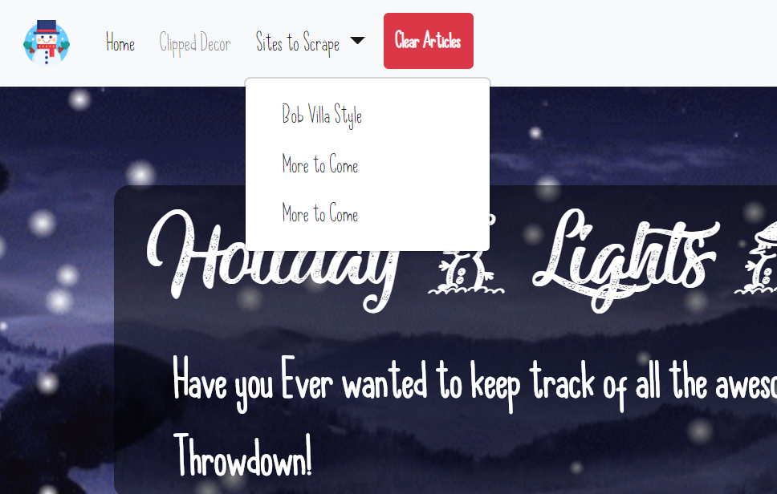
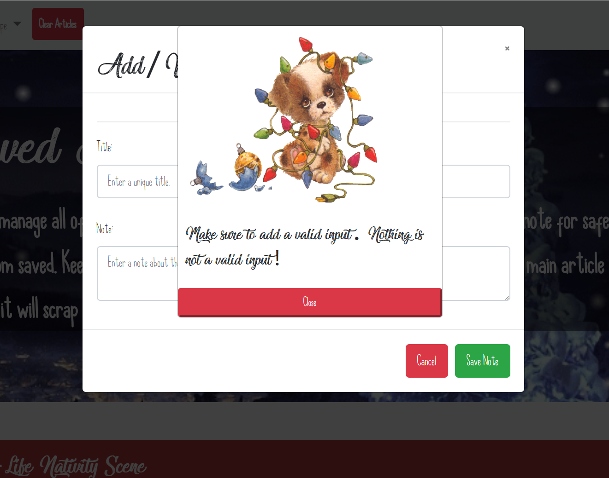

# Holiday Lights Throwdown :christmas_tree::gift::santa::bell::confetti_ball:

##### Technologies Used :
* Javascript, Node.JS, MongoDB, Bootstrap, Mongoose, Handlebars, HTML, CSS

## Landing Page

 This landing page lets you pick the website you would like to scrape and then the articles are displayed below. These articles are stored with the value of false for saved. Once you click a save button it moves it over to the saved section which you can click atop with the 'clipped decor' option. This is a fun demo of how we can use MongoDB to store and manipulate data with the spirit of the holidays.

## Multiple Scrape Option
This is a feature that is in development, but lets you choose multiple sites vs just one to get started.

## Saved Articles Section
This area lets you look at all the saved articles as well as click on the articles to see what notes you have saved.

## Saved Notes Section
Here you can view your notes as well as add a new one. Currently working on the functionality to reload the modal without forcing a refresh of the page. So right now it is manual, but shortly will be smooth and easy going! :metal:

## Null Input Check
This is a null check that has an adorable reminder to enter content for your title and body for your note!

## 404 Error Page
A fun ugly sweater 404 Error with an omage to Rick and Morty.

